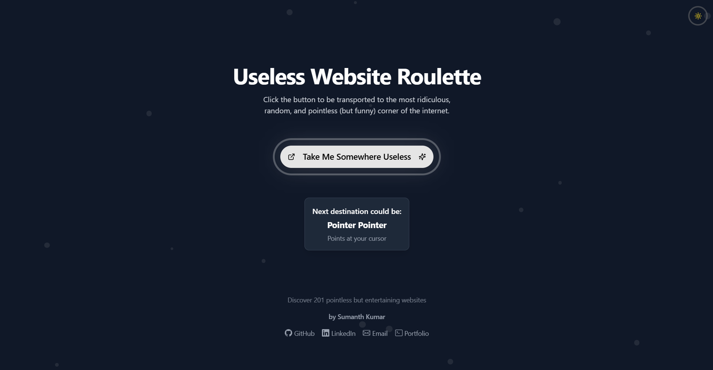

# Web Roulette

Web Roulette is a small Next.js app that helps you pick a random corner of the internet. The homepage shows four site cards at a time, lets you reshuffle the selection, and opens the chosen site in a new tab.



## Live Site

<https://useless-website-roulette.vercel.app/>

## What The Site Does

- Shows a rotating set of useless, funny, weird, and oddly relaxing websites.
- Lets the user select one option from a 2x2 card grid.
- Includes a `Roll it` action to replace the current four choices.
- Launches the selected website in a new browser tab.
- Uses a custom dark visual style with a textured background and simple loading skeletons.

## Tech Stack

- Next.js 16
- React 19
- TypeScript
- Tailwind CSS 4
- Custom client-side UI logic with inline component styling

## Project Structure

- `src/components/useless-website-roulette.tsx`: main roulette interface and interactions
- `lib/useless-websites.ts`: website data source used by the roulette
- `src/app/page.tsx`: homepage entry
- `src/app/layout.tsx`: app metadata and font setup
- `src/app/globals.css`: active global styles and theme variables
- `public/bg.png`: background image used on the page

## Getting Started

```bash
npm install
npm run dev
```

Open `http://localhost:3000` in your browser.

## Available Scripts

- `npm run dev` starts the development server with Turbopack
- `npm run build` creates the production build
- `npm run start` starts the production server
- `npm run lint` runs the Next.js lint command

## Notes

- The app uses a curated local website list rather than fetching entries from an API.
- Path aliases are configured so imports can use `@/` for files inside `src/`.
- The repository currently contains both root-level `app/` files and active `src/app/` files; the live page implementation uses the `src/` codepath described above.
